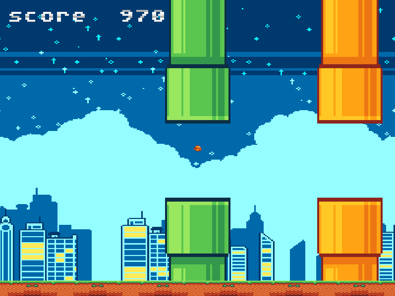

# flappy-bird
Flappy bird game in rust making use of **<a href="https://github.com/Rust-SDL2/rust-sdl2" target="_blank" title="sdl2 library">sdl2 library</a>**

# Screenshot


# How to use it
1. Download and setup sdl2 for rust on your OS by following this <a href="https://github.com/Rust-SDL2/rust-sdl2#requirements">guide</a>
2. I went with the msvc for windows route
3. The guide in step one only shows you how to set up sdl2 but not sdl2_image. The procedure is pretty much the same except you will just be setting up sdl2_image
4. SDL2 and SDL2_image dll's are already included in this repo in the flappy bird files directory.
5. After all of the set-up is done, run:
```
cargo run
```
6. Cargo will build and run your game for you.

# Resources and tutorials followed
1. https://lazyfoo.net/tutorials/SDL/
2. https://blog.logrocket.com/using-sdl2-bindings-rust/
3. https://sunjay.dev/learn-game-dev/getting-started.html

# Assets
1. assets pack: https://megacrash.itch.io/flappy-bird-assets
2. font/text assets pack: https://xinjinmeng.itch.io/xinjinmengs-8-bit-font-pack-feb-2022

# Libraries used
1. SDL2 bindings for Rust: https://github.com/Rust-SDL2/rust-sdl2
2. Amethyst/Legion: https://github.com/amethyst/legion
